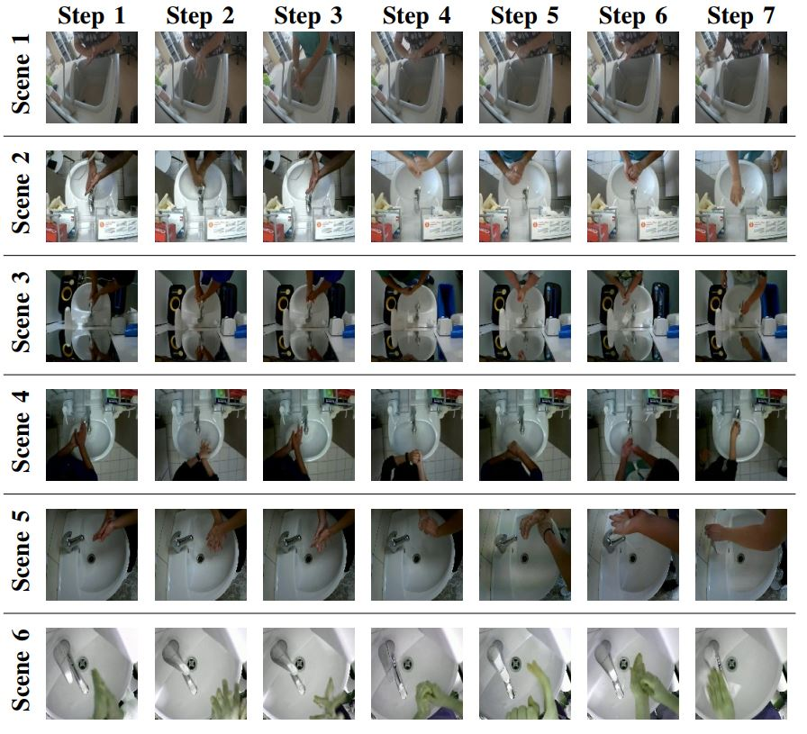

# Fine-grained Hand Gesture Recognition in Multi-viewpoint Hand Hygiene

In this repo, we provide the code for 2 models that are used for evaluation on the MFH dataset: Amdim and Resnet18. The MFH dataset can be downloaded at this [Google Drive link](https://drive.google.com/file/d/1BPuj5HGIOFwE8JQmHobgmnL05ifA60In/view?usp=sharing).


## Tree of directories

```
.
├── Amdim
│   ├── models (store pretrained model)
│   ├── output (store output files of performances)
│   ├── train.sh (script file for training)
│   └── test.sh (script file for testing)
└── Resnet18
    ├── models (store checkpoint files)
    ├── output (store output files of performances)
    ├── train.sh (script file for training)
    └── test.sh (script file for testing)
```

## Packages installation

First, we need to build ```apec``` - a Nvidia mixed precision library for training model faster and using less memory (this library is for Amdim):

- (Optional: This step is only needed when your system cannot find the path to the CUDA ```bin``` and ```lib```. You can first try the steps below, if there is no problem then you may not need this export step.) Export directly in the terminal or add those lines to ```~/.bashrc``` and save the file, then run `source ~/.bashrc` in terminal. Here, we have tried with CUDA 10.1. If your GPU uses another CUDA version or the path to the CUDA ```bin``` and ```lib``` on your system is different, you should set to a suitable path.
```sh
export PATH=/usr/local/cuda-10.1/bin:$PATH
export LD_LIBRARY_PATH=/usr/local/cuda-10.1/lib64:${LD_LIBRARY_PATH}
```

- Install ```miniconda``` for creating Python virtual environment:
```sh
wget https://repo.anaconda.com/miniconda/Miniconda3-latest-Linux-x86_64.sh

chmod +x Miniconda3-latest-Linux-x86_64.sh

./Miniconda3-latest-Linux-x86_64.sh
```

- Create a virtual environment named "pytorch_venv" (or another name you like) with specified version of cudatoolkit and cudnn:
```sh
conda create -n pytorch_venv python=3.7 cudatoolkit=10.1.243 cudnn=7.6.5

conda activate pytorch_venv
```

- Install pytorch, torchvision for cudatoolkit 10.1. Their versions must be the ones specified in the below command.
```sh
conda install pytorch==1.4.0 torchvision==0.5.0 cudatoolkit=10.1 -c pytorch
```

- Build ```apex repo```
```sh
git clone https://github.com/NVIDIA/apex

cd apex

pip install -v --disable-pip-version-check --no-cache-dir --global-option="--cpp_ext" --global-option="--cuda_ext" ./

cd ..
```

- After complete running, the ternminal will inform that `apex` has been built successfully. If you have any problem with installing `apex`, you should find more information at the [Nvidia apex repo](https://github.com/NVIDIA/apex).

Then, to install all the required packages for both Amdim and Resnet18:

```sh
pip install -r requirements.txt
```

## MFH dataset



Link download the MFH dataset: [Google Drive](https://drive.google.com/file/d/1BPuj5HGIOFwE8JQmHobgmnL05ifA60In/view?usp=sharing).

Download the zip file and extract its contents to a free space where you have access to.

Below, we will show how to use Amdim or Resnet18 to train and test on this dataset.

## Amdim

### Download pretrained model

Download the AMDIM pretrained model on ImageNet from this [link](https://drive.google.com/file/d/138l5vXdAmbBwAM_R8aDUb0k4q7JMAdsu/view?usp=sharing) (This file is provided by the authors of AMDIM). Then, put the ```.pth``` file into the folder ```./Amdim/models```.

### Training

In folder ```Amdim```, there is a script file named ```train.sh``` which you can use for training.

Before running, you first need to change the values of some arguments in this file:
- Change the value of ```--input_dir``` to the (absolute) path to the MFH dataset folder (required).
- Change training hyperparameters (optional):

```
NC=7 (number of classes, the MFH dataset has 7 classes)
NE=30 (number of epochs)
BS=32 (batch size)
LR=0.0001 (learning rate)
NDF=256 (Amdim default parameter, do not need to change)
N_RKHS=2048 (Amdim default parameter, do not need to change)
N_DEPTH=8 (Amdim default parameter, do not need to change)
TCLIP=20.0 (Amdim default parameter, do not need to change)
PT="pretrainImageNet"
SCENE="Scene1" (a string that represents a scene that you want to train with)
```

Change the permission for the file to execute:

```sh
cd Amdim
chmod +x train.sh
```

Then, run the file:

```sh
./train.sh
```

After the training completes, there will be a folder ```./Amdim/runs``` that stores the trained model (.pth file).

### Testing

Similarly, there is a script file named ```test.sh``` which you can use for testing.

**Note:** Because the .pth file is named after the arguments'values, you need to keep these corresponding arguments in the file ```test.sh``` with the same values in ```train.sh``` so that the test phase can find the correct file.

Some arguments to change in ```test.sh```:

```sh
TEST_SCENE (The scene to evaluate the trained model on: "Scene1", "Scene2", or "Scene3", ...)
--input_dir (The (absolute) path to the MFH dataset folder)
--checkpoint_path (The path to the checkpoint file ".pth" in the folder "runs")
```

Change the permission for the file to execute:

```sh
chmod +x test.sh
```

Then, run the file:

```sh
./test.sh
```

After running the ```test.sh``` file, there will be an output file storing results in the folder ```./Amdim/output```.

## Resnet18

The Resnet18 folder also has ```train.sh``` and ```test.sh```.

### Training

Before running, you first need to change the values of some arguments in this file:
- Change the value of ```-trd``` to the (absolute) path to the MFH dataset subfolder (required). This is slightly different to above, instead of just the path to the dataset folder, the path need to go down one more level to the subfolder of "Scene". Depending on what scene you want to train with, you can choose "Scene1", "Scene2", ...
- Change training hyperparameters (optional):

```
-ncl 7 (number of classes)
-e 30 (number of epochs)
-iz 224 (the new size of an input image after resizing)
-bz 32 (batch size)
```

Change the permission for the file to execute:

```sh
cd Resnet18
chmod +x train.sh
```

Then, run the file:

```sh
./train.sh
```

After the training completes, model files will be saved into ```./Resnet18/models```.

### Testing

Some arguments to change:

```
-mp (path to the .pth file got from training phase)
-td (path to the subfolder of "Scene" that you want to test on)
-ncl (number of classes)
-iz (the new size of an input image after resizing)
-bz (batch size)
```

Change the permission for the file to execute:

```sh
chmod +x test.sh
```

Then, run the file:

```sh
./test.sh
```

After running the ```test.sh``` file, there will be an output file storing results in the folder ```./Resnet18/output```.

## Citation

```
@article{vo2021fine,
  title={Fine-grained Hand Gesture Recognition in Multi-viewpoint Hand Hygiene},
  author={Vo, Huy Q and Do, Tuong and Pham, Vi C and Nguyen, Duy and Duong, An T and Tran, Quang D},
  journal={arXiv preprint arXiv:2109.02917},
  year={2021}
}
```

## License

MIT License

## Acknowledgement

[1] [Amdim repo](https://github.com/Philip-Bachman/amdim-public)

[2] [Pytorch documentation for transfer learning](https://pytorch.org/tutorials/beginner/transfer_learning_tutorial.html)